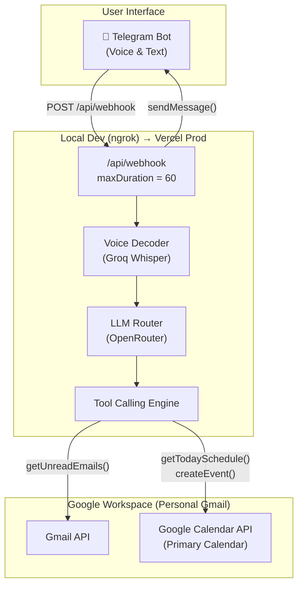
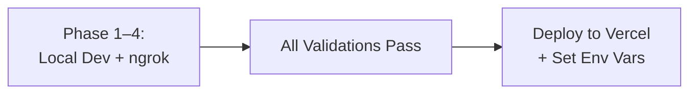

# Dr. Melita Mehjabeen — AI Virtual Assistant

A Telegram-based voice-first AI agent that manages scheduling, email summarization, and personal task management for a professor who chairs a private bank, serves as independent director at BAT Bangladesh & Grameenphone, and teaches at IBA, University of Dhaka.

---

## Architecture Overview



---

## Tech Stack

| Layer | Technology | Rationale |
|---|---|---|
| Bot Platform | Telegram Bot API | Free, voice-note native, mobile-first |
| Local Dev Tunnel | ngrok | Exposes localhost to Telegram webhooks for testing |
| Hosting (Prod) | Vercel Free Tier | Zero-config Next.js deploy, HTTPS, deploy after local validation |
| Framework | Next.js 15 (App Router, TypeScript) | API routes as serverless functions |
| Speech-to-Text | Groq Whisper API | Fast, free-tier generous, high accuracy, Bangla-capable |
| LLM | OpenRouter (see model selection below) | Tool-calling support, model flexibility |
| Email | Gmail API — **Personal Gmail** | No admin approval needed, simpler OAuth2 |
| Calendar | Google Calendar API — **Primary Calendar** | Direct read/write to her main schedule |

### LLM Model Selection (OpenRouter)

We'll evaluate during Phase 2 and pick the best free/cheap model with strong tool-calling:

| Model | Tool-Calling | Context | Cost | Notes |
|---|---|---|---|---|
| `meta-llama/llama-4-scout` | ✅ Native | 512K | Free | Best free option, strong tool-calling |
| `deepseek/deepseek-chat-v3-0324` | ✅ Native | 128K | Free | Excellent reasoning, reliable tools |
| `qwen/qwen3-235b-a22b` | ✅ Native | 128K | Free | Strong multilingual (Bangla support) |

> [!TIP]
> We'll start with **Llama 4 Scout** (free, 512K context — ideal for large email batches). If tool-calling reliability is poor, we'll swap to DeepSeek V3 or Qwen 3 with zero code changes — just an env variable swap.

---

## Development Strategy: Local-First

> [!IMPORTANT]
> We develop and validate **locally** first using `ngrok`, then deploy to Vercel only after all 4 phases pass validation. This avoids slow deploy cycles and lets you debug with real logs.



**How it works:**
1. Run `npm run dev` → Next.js on `http://localhost:3000`
2. Run `ngrok http 3000` → get a public URL like `https://abc123.ngrok-free.app`
3. Register that ngrok URL as the Telegram webhook
4. Telegram sends updates to ngrok → forwarded to your local machine
5. Full debugging with console logs, hot reload, fast iteration

---

## Resolved Decisions

| Question | Decision |
|---|---|
| Telegram Bot Token | Will create via @BotFather at start of Phase 1 |
| API Keys (Groq, OpenRouter) | Will create at start of Phase 2 |
| Google Account | **Personal Gmail** (easier OAuth, no org admin needed) |
| Calendar | **Primary calendar** |
| Bangla Support | Nice-to-have; Whisper handles it natively, LLM prompt will support it |
| Dev Strategy | **Local-first** with ngrok, deploy to Vercel after full validation |

---

## Proposed Changes

### Phase 1: Telegram ↔ Local Dev Bridge

**Goal**: A locally-running Next.js app, tunneled via ngrok, that echoes any Telegram text message back.

**Validation Metric**: Send "Hello" in Telegram → Bot replies "You said: Hello" ✅

**Pre-requisites (you do manually):**
1. Open Telegram → search for [@BotFather](https://t.me/BotFather)
2. Send `/newbot` → follow prompts → name it something like "Dr Melita Assistant"
3. Copy the **API token** BotFather gives you
4. Install ngrok: `npm install -g ngrok` or download from [ngrok.com](https://ngrok.com)

#### [NEW] Project scaffold via `create-next-app`
- Next.js 15, TypeScript, App Router, ESLint
- No Tailwind (API-only project, no UI needed)

#### [NEW] [route.ts](file:///d:/Projects/Virtual%20Assistant/src/app/api/webhook/route.ts)
- `POST` handler receiving Telegram webhook payloads
- `export const maxDuration = 60;` (ready for Vercel)
- Parse `message.text`, call `sendMessage()` to echo back
- Return `200 OK` immediately (Telegram requires fast acknowledgment)

#### [NEW] [telegram.ts](file:///d:/Projects/Virtual%20Assistant/src/lib/telegram.ts)
- `sendMessage(chatId: number, text: string)` — POST to Telegram API
- `setWebhook(url: string)` — register webhook URL

#### [NEW] [set-webhook route](file:///d:/Projects/Virtual%20Assistant/src/app/api/webhook/set/route.ts)
- `GET` handler that calls `setWebhook()` with the current deployment URL
- Hit once after each ngrok restart to re-register the webhook

#### [NEW] `.env.local`
```
TELEGRAM_BOT_TOKEN=<paste from BotFather>
WEBHOOK_URL=<paste from ngrok>
```

#### Validation Steps
```bash
# Terminal 1
npm run dev

# Terminal 2
ngrok http 3000
# Copy the https URL

# Set WEBHOOK_URL in .env.local, then hit:
# GET http://localhost:3000/api/webhook/set

# Open Telegram → send "Hello" to your bot → expect echo
```

---

### Phase 2: Voice Decoding & LLM Intelligence

**Goal**: Send a voice note → Bot transcribes it via Groq Whisper → sends to LLM → replies with intelligent text.

**Validation Metric**: Send a voice note saying "What is the capital of Bangladesh?" → Bot replies with a coherent answer ✅

**Pre-requisites (you do manually):**
1. Go to [console.groq.com](https://console.groq.com) → sign up → create API key
2. Go to [openrouter.ai](https://openrouter.ai) → sign up → create API key
3. Add both to `.env.local`

#### [MODIFY] [route.ts](file:///d:/Projects/Virtual%20Assistant/src/app/api/webhook/route.ts)
- Detect `message.voice` in the update payload
- Branch logic:
  - Text message → send directly to LLM
  - Voice message → download `.ogg` → transcribe via Groq → send transcript to LLM
- Reply with LLM's response

#### [NEW] [groq.ts](file:///d:/Projects/Virtual%20Assistant/src/lib/groq.ts)
- `transcribeAudio(audioBuffer: Buffer): Promise<string>`
- Download `.ogg` from Telegram's `getFile` API into memory (no disk writes)
- POST multipart/form-data to Groq `/audio/transcriptions` (model: `whisper-large-v3`)
- Bangla-capable out of the box (Whisper auto-detects language)

#### [NEW] [llm.ts](file:///d:/Projects/Virtual%20Assistant/src/lib/llm.ts)
- `chat(userMessage: string): Promise<string>`
- POST to OpenRouter `/chat/completions`
- Default model: `meta-llama/llama-4-scout` (configurable via env var)
- System prompt:

```
You are the personal AI assistant for Dr. Melita Mehjabeen.

About her:
- Chairperson of a private bank in Bangladesh
- Independent Director at BAT Bangladesh and Grameenphone
- Professor at IBA, University of Dhaka

Your role:
- Manage her schedule and calendar
- Summarize emails, highlighting actionable items
- Draft brief replies when asked
- Be concise, professional, and proactive
- Use bullet points for summaries
- Always confirm before making changes to her schedule
- If she speaks in Bangla, respond in Bangla
```

#### [NEW] `.env.local` additions
```
GROQ_API_KEY=<from groq console>
OPENROUTER_API_KEY=<from openrouter>
LLM_MODEL=meta-llama/llama-4-scout
```

---

### Phase 3: Google Workspace Authentication

**Goal**: The bot can read the professor's Gmail inbox and Calendar programmatically.

**Validation Metric**: Console logs a real email subject line and a real calendar event title ✅

**Pre-requisites (you do manually):**
1. Go to [Google Cloud Console](https://console.cloud.google.com)
2. Create a new project (e.g., "Melita Assistant")
3. Enable **Gmail API** and **Google Calendar API**
4. Create OAuth2 credentials (Desktop App type)
5. Download the `credentials.json`
6. Run our token generation script to get the refresh token (one-time browser auth)

#### [NEW] [google-auth.ts](file:///d:/Projects/Virtual%20Assistant/src/lib/google-auth.ts)
- Build OAuth2 client from `CLIENT_ID`, `CLIENT_SECRET`, `REFRESH_TOKEN`
- Auto-refresh access tokens using the stored refresh token
- Export `getAuthClient()` for use by Gmail and Calendar modules

#### [NEW] [gmail.ts](file:///d:/Projects/Virtual%20Assistant/src/lib/gmail.ts)
- `getUnreadEmails(maxResults = 10): Promise<EmailSummary[]>`
  - Fetch unread messages via Gmail API
  - Extract: sender, subject, snippet, date, labels
  - Return structured array ready for LLM summarization

#### [NEW] [calendar.ts](file:///d:/Projects/Virtual%20Assistant/src/lib/calendar.ts)
- `getTodaySchedule(): Promise<CalendarEvent[]>` — today's events from **primary** calendar
- `getUpcomingEvents(days: number): Promise<CalendarEvent[]>` — next N days
- `createEvent(details): Promise<CalendarEvent>` — create event on primary calendar
- All functions target `calendarId: 'primary'`

#### [NEW] [types.ts](file:///d:/Projects/Virtual%20Assistant/src/lib/types.ts)
- `EmailSummary` — sender, subject, snippet, date, id
- `CalendarEvent` — title, start, end, location, attendees, description
- `NewEvent` — title, startTime, endTime, description (optional)
- `TelegramUpdate`, `TelegramMessage`, `TelegramVoice`

#### [NEW] [generate-google-token.ts](file:///d:/Projects/Virtual%20Assistant/scripts/generate-google-token.ts)
- Interactive CLI script for one-time OAuth consent flow
- Opens browser → professor logs in → authorizes → script captures refresh token
- Prints the `GOOGLE_REFRESH_TOKEN` to copy into `.env.local`

#### [NEW] `.env.local` additions
```
GOOGLE_CLIENT_ID=<from cloud console>
GOOGLE_CLIENT_SECRET=<from cloud console>
GOOGLE_REFRESH_TOKEN=<from generate-google-token script>
```

#### Validation Steps
```bash
# Run the token generation script first
npx ts-node scripts/generate-google-token.ts

# Then test in the webhook route (add a temporary test endpoint)
# GET /api/test-google → logs email subjects and calendar events
```

---

### Phase 4: Agentic Tool Calling

**Goal**: A single voice command triggers real actions — email summaries, calendar reads/writes — through an agentic LLM loop.

**Validation Metric**: Voice note "Schedule a meeting tomorrow at 3 PM about thesis review" → Bot creates a real Calendar event and confirms ✅

#### [MODIFY] [llm.ts](file:///d:/Projects/Virtual%20Assistant/src/lib/llm.ts)
- Upgrade to **tool-calling** mode with function definitions
- Define 4 tools: `getUnreadEmails`, `getTodaySchedule`, `getUpcomingEvents`, `createEvent`
- Return structured tool call requests instead of plain text when the LLM decides to use tools

#### [NEW] [agent.ts](file:///d:/Projects/Virtual%20Assistant/src/lib/agent.ts)
- **Agentic loop**:
  1. User message → LLM (with tools)
  2. If LLM returns tool calls → execute them → feed results back to LLM
  3. If LLM returns text → that's the final answer → send to Telegram
  4. Loop up to 3 iterations (safety limit to avoid runaway chains)
- **Tool router**: Maps tool call names → actual functions from gmail.ts / calendar.ts
- Error handling: If a tool fails, feed the error message back to the LLM to recover gracefully

#### [MODIFY] [route.ts](file:///d:/Projects/Virtual%20Assistant/src/app/api/webhook/route.ts)
- Replace direct `chat()` call with `runAgent(userMessage)` from agent.ts
- Add graceful timeout handling (warn user if approaching 60s limit)

#### Tool Definitions
```typescript
const tools = [
  {
    type: "function",
    function: {
      name: "getUnreadEmails",
      description: "Fetch unread emails from Dr. Mehjabeen's inbox. Returns sender, subject, and snippet.",
      parameters: {
        type: "object",
        properties: {
          maxResults: { type: "number", description: "Max emails to fetch (default 10)" }
        }
      }
    }
  },
  {
    type: "function",
    function: {
      name: "getTodaySchedule",
      description: "Get all of Dr. Mehjabeen's calendar events for today",
      parameters: { type: "object", properties: {} }
    }
  },
  {
    type: "function",
    function: {
      name: "getUpcomingEvents",
      description: "Get calendar events for the next N days",
      parameters: {
        type: "object",
        properties: {
          days: { type: "number", description: "Number of days to look ahead" }
        },
        required: ["days"]
      }
    }
  },
  {
    type: "function",
    function: {
      name: "createEvent",
      description: "Create a new event on Dr. Mehjabeen's primary calendar",
      parameters: {
        type: "object",
        properties: {
          title: { type: "string" },
          startTime: { type: "string", description: "ISO 8601 datetime" },
          endTime: { type: "string", description: "ISO 8601 datetime" },
          description: { type: "string" }
        },
        required: ["title", "startTime", "endTime"]
      }
    }
  }
];
```

---

## Final File Structure

```
d:\Projects\Virtual Assistant\
├── src/
│   ├── app/
│   │   └── api/
│   │       └── webhook/
│   │           ├── route.ts          # Main Telegram webhook handler
│   │           └── set/
│   │               └── route.ts      # One-time webhook registration
│   └── lib/
│       ├── telegram.ts               # Telegram Bot API client
│       ├── groq.ts                   # Groq Whisper transcription
│       ├── llm.ts                    # OpenRouter LLM with tool-calling
│       ├── agent.ts                  # Agentic tool execution loop
│       ├── google-auth.ts            # Google OAuth2 client
│       ├── gmail.ts                  # Gmail API utilities
│       ├── calendar.ts               # Google Calendar API utilities
│       └── types.ts                  # TypeScript interfaces
├── scripts/
│   └── generate-google-token.ts      # One-time OAuth token generator
├── .env.local                        # Environment variables (git-ignored)
├── .gitignore
├── next.config.ts
├── tsconfig.json
├── package.json
└── README.md
```

---

## Environment Variables (Complete)

| Variable | Phase | Source | When to Create |
|---|---|---|---|
| `TELEGRAM_BOT_TOKEN` | 1 | [@BotFather](https://t.me/BotFather) | Before Phase 1 |
| `WEBHOOK_URL` | 1 | ngrok output | Each dev session |
| `GROQ_API_KEY` | 2 | [console.groq.com](https://console.groq.com) | Before Phase 2 |
| `OPENROUTER_API_KEY` | 2 | [openrouter.ai](https://openrouter.ai) | Before Phase 2 |
| `LLM_MODEL` | 2 | OpenRouter model ID | Before Phase 2 |
| `GOOGLE_CLIENT_ID` | 3 | Google Cloud Console | Before Phase 3 |
| `GOOGLE_CLIENT_SECRET` | 3 | Google Cloud Console | Before Phase 3 |
| `GOOGLE_REFRESH_TOKEN` | 3 | OAuth script output | Before Phase 3 |

---

## Verification Plan

### Phase 1 ✉️
- `npm run dev` + `ngrok http 3000` + set webhook
- Send "Hello" → bot echoes "You said: Hello"
- Test edge cases: empty message, emoji-only, long text

### Phase 2 🎤
- Send voice note in English → get intelligent reply
- Send text message → get intelligent reply
- (Optional) Send Bangla voice note → verify transcription
- Verify no timeouts on the full voice → transcribe → LLM pipeline

### Phase 3 📧
- Run token generation script with professor's personal Gmail
- Call `getUnreadEmails()` → see real email subjects in console
- Call `getTodaySchedule()` → see real calendar events in console

### Phase 4 🤖
- Voice: "Summarize my emails" → bot fetches and summarizes unread emails
- Voice: "What's my schedule today?" → bot lists today's events
- Voice: "Schedule a thesis review meeting tomorrow at 3 PM" → bot creates event, confirms
- Voice: "Am I free on Friday afternoon?" → bot checks calendar, responds

---

## Deployment to Vercel (After All Phases Pass)

Once all 4 phases validate locally:

1. Push to your GitHub repo
2. Import project into Vercel
3. Copy all `.env.local` variables → Vercel Environment Variables
4. Deploy
5. Update `WEBHOOK_URL` to the Vercel production URL
6. Hit `/api/webhook/set` once to re-register the Telegram webhook on the Vercel URL
7. Verify all 4 phase validations pass on Vercel

---

## Execution Rules

> [!CAUTION]
> **Hard Gate**: No code for Phase N+1 will be written until Phase N's validation metric passes. Each phase is a self-contained deliverable.

Phase progression: **1 → 2 → 3 → 4 → Deploy** (strictly sequential).
