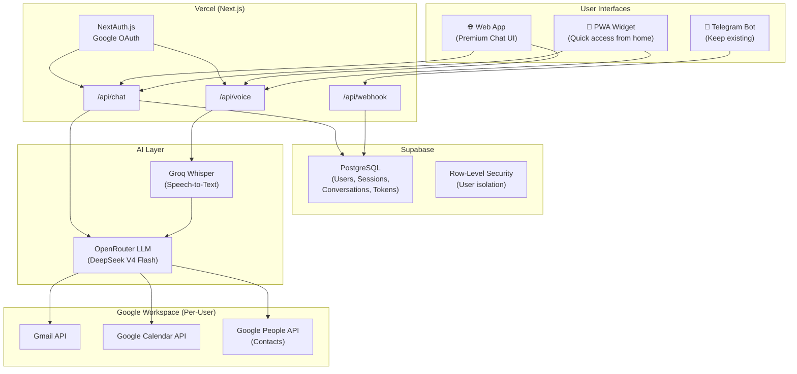

# Multi-User AI Personal Assistant — Full Rewrite Plan

**Current state:** A single-user Telegram bot + web UI built with Next.js, using hardcoded Google OAuth credentials in `.env.local`. Supports voice/text chat via OpenRouter LLM, email read/send (Gmail API), and calendar read/write (Google Calendar API). Email sending works from Telegram but **fails silently from the web interface** (LLM claims success but email doesn't actually send).

**Goal:** Transform this into a multi-user (≤4), production-deployed personal assistant with proper auth, data isolation, Google Contacts, schedule intelligence, widget-based access, and a premium UI — deployed on Vercel + Supabase.

---

## Architecture Overview



---

## User Review Required

> [!IMPORTANT]
> **Database choice: Supabase (Recommended)**
> For ≤4 users, Supabase Free Tier is perfect. It gives you:
> - Full PostgreSQL with Row-Level Security (user data isolation out of the box)
> - Built-in support for NextAuth.js adapter (stores tokens, sessions, accounts)
> - Per-user Google OAuth token storage (each user gets their own refresh_token)
> - Conversation/session persistence (survives Vercel cold starts — unlike the current in-memory `session.ts`)
> - Free tier: 500MB database, 50K monthly active users, unlimited API requests
>
> Vercel alone cannot do this — it has no persistent database. Vercel KV (Redis) is for caching, not auth/relational data.

> [!IMPORTANT]
> **Widget approach: PWA + Telegram shortcut (NOT a native widget)**
> Native home screen widgets are impossible from a web app (PWA). However, we have two practical alternatives:
> 1. **PWA installable mini-app** — Install the web app to home screen. It opens instantly in standalone mode (no browser chrome). We'll build a "compact mode" that shows just the textbox + mic button, optimized for quick interactions.
> 2. **Keep Telegram as the "widget"** — Telegram already lives on your home screen. You just open it, type/speak, done. This is arguably the fastest path for quick interactions.
> 3. **Future: Capacitor native wrapper** — If you later want a true Android home screen widget (shows next meeting, quick voice button), we'd wrap the app with Capacitor. This is Phase 7+ material.
>
> **Recommendation:** Build the PWA compact mode first. It's the fastest to ship and gives you "home screen → textbox + mic" in 2 taps.

> [!WARNING]
> **Email send bug diagnosis:**
> The web UI uses `/api/chat` → `runAgent()` → `sendEmail()`. The Telegram webhook uses `/api/webhook` → `runAgent()` → `sendEmail()`. Both call the **exact same** `sendEmail()` function in [gmail.ts](file:///d:/Projects/Virtual%20Assistant/src/lib/gmail.ts). The issue is almost certainly one of these:
> 1. **Conversation history doesn't carry confirmation context** — The web UI sends `history` as simple user/assistant message pairs, but the agent's email flow requires a 2-step confirmation ("Shall I send?" → "Yes"). The web frontend strips tool_call messages from history, so the agent may "think" it already confirmed and hallucinate the send without actually calling the tool.
> 2. **The LLM bypasses tool calling on the web path** — Instead of making a real `sendEmail` tool call, the LLM generates text like "Email sent!" without actually invoking the tool, because it lacks the prior tool interaction context.
>
> **Fix:** We'll refactor the session system to persist full conversation state (including tool calls) in Supabase, and ensure the web frontend sends proper session IDs instead of raw message history. This naturally resolves as part of Phase 2.

---

## Open Questions

> [!IMPORTANT]
> 1. **Telegram bot — keep for both you and your teacher, or separate bots?** Currently the Telegram bot uses a single set of Google credentials (your teacher's). If you both use the same bot, the bot needs to identify who is talking (via Telegram `chat_id` → mapped to Supabase user). If you want separate bots, we just create a second one via BotFather.
> 
> 2. **Google Cloud project — one shared or per-user?** With Supabase multi-user auth, each user logs in with their own Google account and grants their own permissions. We use ONE Google Cloud project (your existing one), but each user's OAuth consent gives us a separate `refresh_token` stored per-user in Supabase. This is the standard approach.
>
> 3. **Your teacher's existing refresh token** — We need to migrate her existing hardcoded `GOOGLE_REFRESH_TOKEN` into Supabase as her account record. She may need to re-authenticate once via the new web login flow.
>
> 4. **Do you want a "compact mode" toggle in the web UI, or a separate `/widget` route?** I recommend a separate `/widget` route — cleaner, and the PWA manifest can point to it.

---

## Proposed Changes

### Phase 1: Supabase Setup + NextAuth.js Multi-User Auth
**Goal:** Users can log in with Google, granting Gmail + Calendar + Contacts permissions. Each user's tokens are stored in Supabase. User data is isolated.

**Estimated effort:** 1 day

---

#### Supabase Project Setup (Manual)
- Create a Supabase project at [supabase.com](https://supabase.com)
- Note the `SUPABASE_URL` and `SUPABASE_ANON_KEY`
- The NextAuth adapter will auto-create the `next_auth` schema with tables: `users`, `accounts`, `sessions`, `verification_tokens`

#### Database Schema (Custom Tables)

```sql
-- Conversations table: stores sessions per user
CREATE TABLE conversations (
  id UUID DEFAULT gen_random_uuid() PRIMARY KEY,
  user_id UUID REFERENCES next_auth.users(id) ON DELETE CASCADE,
  title TEXT DEFAULT 'New Conversation',
  created_at TIMESTAMPTZ DEFAULT now(),
  updated_at TIMESTAMPTZ DEFAULT now()
);

-- Messages table: stores all messages in a conversation
CREATE TABLE messages (
  id UUID DEFAULT gen_random_uuid() PRIMARY KEY,
  conversation_id UUID REFERENCES conversations(id) ON DELETE CASCADE,
  role TEXT NOT NULL CHECK (role IN ('user', 'assistant', 'system', 'tool')),
  content TEXT,
  tool_calls JSONB,          -- stores LLM tool_call responses
  tool_call_id TEXT,          -- for tool response messages
  name TEXT,                  -- tool name for tool responses
  created_at TIMESTAMPTZ DEFAULT now()
);

-- Telegram mapping: links Telegram chat_id to Supabase user
CREATE TABLE telegram_mappings (
  telegram_chat_id BIGINT PRIMARY KEY,
  user_id UUID REFERENCES next_auth.users(id) ON DELETE CASCADE,
  created_at TIMESTAMPTZ DEFAULT now()
);

-- Row Level Security
ALTER TABLE conversations ENABLE ROW LEVEL SECURITY;
ALTER TABLE messages ENABLE ROW LEVEL SECURITY;
ALTER TABLE telegram_mappings ENABLE ROW LEVEL SECURITY;

-- Policies: users can only see their own data
CREATE POLICY "Users own conversations" ON conversations
  FOR ALL USING (user_id = auth.uid());

CREATE POLICY "Users own messages" ON messages
  FOR ALL USING (
    conversation_id IN (
      SELECT id FROM conversations WHERE user_id = auth.uid()
    )
  );
```

#### [NEW] `src/lib/supabase.ts`
- Initialize Supabase client (server-side with service role key for API routes)
- Export `supabaseAdmin` for use in API routes

#### [NEW] Auth Configuration
- Install `next-auth`, `@auth/supabase-adapter`, `@supabase/supabase-js`
- Configure Google provider with expanded scopes:
  ```
  openid email profile
  https://www.googleapis.com/auth/gmail.readonly
  https://www.googleapis.com/auth/gmail.send
  https://www.googleapis.com/auth/calendar
  https://www.googleapis.com/auth/contacts.readonly
  ```
- Store `access_token`, `refresh_token`, `expires_at` per-user via Supabase adapter
- JWT callback: auto-refresh expired Google tokens
- Session callback: expose `userId` and `accessToken` to the client

#### [NEW] `src/app/api/auth/[...nextauth]/route.ts`
- NextAuth.js API route with Google provider + Supabase adapter

#### [MODIFY] `src/lib/google-auth.ts`
- Change from hardcoded env vars → **per-user token lookup from Supabase**
- `getAuthClient(userId: string)` — fetches the user's refresh_token from Supabase, builds OAuth2 client

#### [NEW] `.env.local` additions
```
NEXTAUTH_URL=http://localhost:3000
NEXTAUTH_SECRET=<generate with openssl rand -base64 32>
SUPABASE_URL=<from supabase dashboard>
SUPABASE_SERVICE_ROLE_KEY=<from supabase dashboard>
SUPABASE_ANON_KEY=<from supabase dashboard>
```

#### Google Cloud Console Updates (Manual)
- Add `http://localhost:3000/api/auth/callback/google` to authorized redirect URIs
- Add Vercel production URL later
- Enable **People API** (for contacts)
- Add contacts.readonly scope to OAuth consent screen

#### Validation
- Visit `http://localhost:3000` → redirected to Google login
- Login → tokens stored in Supabase `accounts` table
- Second user logs in → separate record in `accounts`

---

### Phase 2: Conversation Persistence + Session Refactor
**Goal:** Replace in-memory sessions with Supabase. Full conversation history (including tool calls) persisted. Each user's data isolated.

**Estimated effort:** 1 day

---

#### [DELETE] `src/lib/session.ts`
- Remove the in-memory session store entirely

#### [NEW] `src/lib/conversation.ts`
- `createConversation(userId: string): Promise<Conversation>`
- `getConversations(userId: string): Promise<Conversation[]>` — list all sessions
- `getConversationMessages(conversationId: string): Promise<ChatMessage[]>` — full history
- `addMessage(conversationId: string, message: ChatMessage): Promise<void>`
- `deleteConversation(conversationId: string): Promise<void>`

#### [MODIFY] `src/lib/agent.ts`
- Accept `userId` parameter → used to create per-user Google auth client
- Accept `conversationId` parameter → loads history from Supabase instead of accepting raw history array
- Persist each message (user, assistant, tool) to Supabase after each loop iteration
- System prompt changes:
  - Remove hardcoded "Dr. Melita Mehjabeen" references
  - Make the persona dynamic based on user profile
  - Add: **"Always write emails in English, regardless of what language the user gives instructions in."**
  - Add: **"When asked about availability or meeting times, check the calendar and identify free time slots."**

#### [MODIFY] `src/app/api/chat/route.ts`
- Require authentication (check NextAuth session)
- Extract `userId` from session
- Accept `conversationId` (or create new one)
- Pass `userId` + `conversationId` to `runAgent()`

#### [MODIFY] `src/app/api/voice/route.ts`
- Same auth + conversation handling as chat route

#### [MODIFY] `src/app/api/webhook/route.ts`
- Look up Telegram `chat_id` → `user_id` via `telegram_mappings` table
- If no mapping found, reply with a registration link
- Load/create conversation for the Telegram user
- Use per-user Google credentials

#### **Email send bug fix** (resolved here)
- Since conversations now persist tool_call messages in Supabase, the agent always has full context
- The web UI sends `conversationId` instead of raw history — no more lost tool_call context
- The 2-step email confirmation flow ("Shall I send?" → "Yes, send it") now works identically on both web and Telegram

#### Validation
- Web: Start conversation → ask "summarize my emails" → response uses YOUR Gmail, not the teacher's
- Web: Send email confirmation flow works end-to-end (email actually arrives)
- Telegram: Same flows work
- Switch users → each sees only their own conversations

---

### Phase 3: Google Contacts Integration + Smart Email Sending
**Goal:** "Send email to Rahim" → bot looks up Rahim in Google Contacts, finds his email, and drafts the email.

**Estimated effort:** 0.5 day

---

#### [NEW] `src/lib/contacts.ts`
- `searchContacts(userId: string, query: string): Promise<Contact[]>`
  - Uses Google People API `people.searchContacts` method
  - Returns name, email, phone
  - Requires `contacts.readonly` scope (already granted in Phase 1)
- `listContacts(userId: string, pageSize?: number): Promise<Contact[]>`
  - Lists all contacts for browsing/caching
- Warmup request handling (Google requires a cache warmup call before first search)

#### [MODIFY] `src/lib/agent-tools.ts`
- Add new tool: `searchContacts`
  ```typescript
  {
    name: "searchContacts",
    description: "Search the user's Google Contacts by name to find their email address, phone number, etc. Use this when the user asks to send email to someone by name instead of email address.",
    parameters: {
      type: "object",
      properties: {
        query: { type: "string", description: "Name or partial name to search for" }
      },
      required: ["query"]
    }
  }
  ```
- Update `executeToolCall` to route `searchContacts` → `contacts.ts`
- All tool calls now accept `userId` to use per-user Google credentials

#### [MODIFY] `src/lib/agent.ts` — System prompt update
- Add: "When the user asks to send an email to someone by name (not email address), use the searchContacts tool first to look up their email address."

#### [MODIFY] `src/lib/types.ts`
- Add `Contact` interface: `name`, `email`, `phone`, `organization`

#### Validation
- "Send an email to Rahim about tomorrow's meeting" → bot searches contacts → finds Rahim's email → drafts email → asks confirmation → sends

---

### Phase 4: Schedule Intelligence (Availability Finder)
**Goal:** "When am I free this week?" → bot checks calendar and suggests available slots. "Find a 1-hour slot for a meeting with 3 people this Thursday" → bot checks and suggests.

**Estimated effort:** 0.5 day

---

#### [NEW] `src/lib/schedule.ts`
- `getAvailableSlots(userId: string, date: Date, durationMinutes?: number): Promise<TimeSlot[]>`
  - Fetches all events for the date
  - Calculates gaps between events (considering working hours: 9 AM – 8 PM BST)
  - Returns available slots with start/end times
- `getWeekAvailability(userId: string, startDate: Date): Promise<DayAvailability[]>`
  - Runs `getAvailableSlots` for each day of the week
  - Returns structured availability per day

#### [MODIFY] `src/lib/agent-tools.ts`
- Add tool: `getAvailableSlots`
  ```typescript
  {
    name: "getAvailableSlots",
    description: "Find available time slots on a specific date by analyzing the user's calendar. Use when the user asks 'when am I free?', 'find a time for a meeting', or 'am I available on Thursday?'",
    parameters: {
      type: "object",
      properties: {
        date: { type: "string", description: "Date to check (YYYY-MM-DD format)" },
        durationMinutes: { type: "number", description: "Minimum slot duration needed (default 30)" }
      },
      required: ["date"]
    }
  }
  ```
- Add tool: `getWeekAvailability`

#### Validation
- "When am I free tomorrow?" → lists available time slots
- "Can I fit a 2-hour meeting on Friday?" → checks and responds with options
- "Schedule a meeting at the first available slot tomorrow afternoon" → finds slot → creates event

---

### Phase 5: Premium UI + Compact Widget Mode
**Goal:** Complete UI overhaul — dark theme, glassmorphism, conversation sidebar, and a `/widget` route for home screen quick access.

**Estimated effort:** 1.5 days

---

#### [MODIFY] `src/app/page.tsx` — Full Redesign
**New features:**
- **Login/logout** (NextAuth session)
- **Conversation sidebar** — list past sessions, start new ones, delete old ones
- **Dark mode** default with glass-effect cards
- **Conversation titles** — auto-generated from first message
- **User avatar** from Google profile
- **Typing indicator** with animated dots
- **Message timestamps**
- **Email/Calendar action cards** — when the bot reads emails or creates events, show structured cards (not just text)
- **Responsive** — works on mobile and desktop

**Design system:**
- Colors: Deep navy (`#0a0e1a`) background, electric blue (`#3b82f6`) accent, glass panels with `backdrop-filter: blur(20px)` and `rgba(255,255,255,0.05)` backgrounds
- Typography: Inter font (already loaded)
- Animations: Smooth slide-in for messages, pulse for recording, shimmer for loading
- Glassmorphism cards for bot responses containing structured data

#### [NEW] `src/app/widget/page.tsx` — Compact Widget Mode
- Minimal UI: just a textbox + mic button + last assistant response
- No sidebar, no header, minimal chrome
- Optimized for PWA standalone mode on mobile
- Sends to same `/api/chat` and `/api/voice` endpoints
- Auto-creates a new conversation each day (or continues today's)
- Background: transparent/blurred (feels like an overlay)

#### [MODIFY] `src/app/globals.css` — Complete Redesign
- Dark theme design system
- Glassmorphism utilities
- Responsive breakpoints
- Animation keyframes
- Widget-specific styles

#### [MODIFY] `src/app/layout.tsx`
- Add NextAuth `SessionProvider`
- Update metadata for PWA

#### [NEW] `src/app/login/page.tsx`
- Beautiful login page with Google Sign-In button
- Animated background
- Explains permissions being requested

#### [MODIFY] `public/manifest.json`
- Update for widget mode: `start_url: "/widget"` for the home screen shortcut
- Add shortcuts array for "Quick Message" and "Full App"

#### Validation
- Open web app → see login page → sign in with Google
- Land on premium dark chat UI with sidebar
- Conversation history loads from Supabase
- Install PWA → open from home screen → compact widget mode
- Send message from widget → works

---

### Phase 6: Vercel Deployment + Production Hardening
**Goal:** Deploy to Vercel, fix all production issues, wire up Telegram webhook to production URL.

**Estimated effort:** 0.5 day

---

#### Vercel Setup
1. Push to GitHub
2. Import to Vercel
3. Set all environment variables:
   - `NEXTAUTH_URL` → production URL
   - `NEXTAUTH_SECRET`
   - `SUPABASE_URL`, `SUPABASE_SERVICE_ROLE_KEY`, `SUPABASE_ANON_KEY`
   - `TELEGRAM_BOT_TOKEN`
   - `GROQ_API_KEY`, `OPENROUTER_API_KEY`, `LLM_MODEL`
   - `GOOGLE_CLIENT_ID`, `GOOGLE_CLIENT_SECRET`
4. Add Vercel production URL to Google Cloud Console authorized redirect URIs
5. Update Telegram webhook to production URL

#### Production Fixes
- Rate limiting on API routes (prevent abuse)
- Error boundary in React UI
- Proper CORS headers
- `maxDuration: 60` on all AI routes (already set)
- CSP headers for security

#### [NEW] `src/middleware.ts`
- Protect `/api/chat`, `/api/voice` routes — require NextAuth session
- Allow `/api/webhook` without auth (Telegram uses its own verification)
- Redirect unauthenticated users to login page

#### Validation
- All features work on Vercel production URL
- Telegram bot works via Vercel (not ngrok)
- Email sending works from BOTH Telegram and web (bug confirmed fixed)
- Multiple users can log in simultaneously with isolated data

---

### Phase 7: Additional Executive Features (Research-Based Recommendations)
**Goal:** Features that a very busy executive would find indispensable, based on industry research.

**Estimated effort:** 2-3 days (can be done incrementally)

---

These are features to add after the core platform is stable:

#### 7A. Daily Briefing (Morning Summary)
- **What:** Every morning at 7 AM, the bot proactively sends a summary:
  - Today's schedule
  - Unread priority emails (filtered, top 5)
  - Pending action items from yesterday
  - Weather in Dhaka
- **How:** Vercel Cron Job → `/api/cron/daily-briefing` → sends via Telegram to all registered users
- **Effort:** 0.5 day

#### 7B. Email Reply Drafting
- **What:** "Reply to the email from Karim about the board meeting" → bot fetches the email thread, drafts a contextual reply, and sends after confirmation
- **How:** Add `getEmailThread` and `replyToEmail` tools using Gmail API's thread support
- **Effort:** 0.5 day

#### 7C. Meeting Preparation Notes
- **What:** "Prep me for the 3 PM meeting" → bot looks up the calendar event, finds attendees, searches recent emails from those attendees, and compiles a briefing
- **How:** New tool `prepareForMeeting` that chains calendar lookup → attendee extraction → email search → LLM summary
- **Effort:** 0.5 day

#### 7D. Follow-Up Reminders
- **What:** After sending an email, the bot asks "Shall I set a follow-up reminder if they don't reply in 2 days?" → creates a calendar event or notification
- **How:** `createReminder` tool → creates a calendar event with a reminder notification
- **Effort:** 0.5 day

#### 7E. Quick Notes / Voice Memos
- **What:** "Note: need to call the bank about the loan restructuring" → bot saves it as a searchable note
- **How:** New `notes` table in Supabase, `saveNote` and `searchNotes` tools
- **Effort:** 0.5 day

#### 7F. Document Summarization
- **What:** Forward a PDF or long email → bot summarizes the key points
- **How:** Accept document attachments in Telegram and web, extract text, send to LLM for summary
- **Effort:** 0.5 day

#### 7G. Priority Inbox
- **What:** Instead of showing ALL unread emails, the bot uses LLM to categorize: 🔴 Urgent, 🟡 Important, 🟢 FYI
- **How:** Fetch emails → LLM classifies → present in priority order
- **Effort:** 0.5 day

---

## Phased Execution Timeline

| Phase | What | Depends On | Est. Time | Priority |
|:---:|:---|:---:|:---:|:---:|
| **1** | Supabase + NextAuth multi-user auth | — | 1 day | 🔴 Critical |
| **2** | Conversation persistence + email bug fix | Phase 1 | 1 day | 🔴 Critical |
| **3** | Google Contacts integration | Phase 2 | 0.5 day | 🟡 High |
| **4** | Schedule intelligence | Phase 2 | 0.5 day | 🟡 High |
| **5** | Premium UI + widget mode | Phase 2 | 1.5 days | 🟡 High |
| **6** | Vercel deployment | Phase 1-5 | 0.5 day | 🔴 Critical |
| **7A-G** | Executive features (incremental) | Phase 6 | 2-3 days | 🟢 Nice-to-have |

**Total estimated time to production (Phases 1-6): ~5 days**

---

## Final File Structure (After Phase 6)

```
d:\Projects\Virtual Assistant\
├── src/
│   ├── app/
│   │   ├── api/
│   │   │   ├── auth/[...nextauth]/route.ts  [NEW] NextAuth handler
│   │   │   ├── chat/route.ts                [MODIFY] + auth + conversation
│   │   │   ├── voice/route.ts               [MODIFY] + auth + conversation
│   │   │   ├── conversations/route.ts       [NEW] CRUD for conversations
│   │   │   ├── webhook/route.ts             [MODIFY] + user lookup + Supabase
│   │   │   └── webhook/set/route.ts         (unchanged)
│   │   ├── login/page.tsx                   [NEW] Login page
│   │   ├── widget/page.tsx                  [NEW] Compact widget mode
│   │   ├── page.tsx                         [MODIFY] Full chat UI redesign
│   │   ├── layout.tsx                       [MODIFY] + SessionProvider
│   │   └── globals.css                      [MODIFY] Dark theme redesign
│   ├── lib/
│   │   ├── supabase.ts                      [NEW] Supabase client
│   │   ├── conversation.ts                  [NEW] Conversation CRUD
│   │   ├── contacts.ts                      [NEW] Google Contacts
│   │   ├── schedule.ts                      [NEW] Availability finder
│   │   ├── agent.ts                         [MODIFY] Per-user, persistent
│   │   ├── agent-tools.ts                   [MODIFY] + contacts, schedule
│   │   ├── google-auth.ts                   [MODIFY] Per-user tokens
│   │   ├── gmail.ts                         [MODIFY] Accept userId
│   │   ├── calendar.ts                      [MODIFY] Accept userId
│   │   ├── groq.ts                          (mostly unchanged)
│   │   ├── telegram.ts                      (unchanged)
│   │   └── types.ts                         [MODIFY] + new types
│   └── middleware.ts                        [NEW] Auth protection
├── public/
│   ├── manifest.json                        [MODIFY] Widget shortcuts
│   └── icons/                               (unchanged)
├── .env.local                               [MODIFY] + Supabase keys
├── package.json                             [MODIFY] + new deps
└── ...
```

---

## Environment Variables (Complete)

| Variable | Phase | Source |
|:---|:---:|:---|
| `TELEGRAM_BOT_TOKEN` | existing | @BotFather |
| `GROQ_API_KEY` | existing | console.groq.com |
| `OPENROUTER_API_KEY` | existing | openrouter.ai |
| `LLM_MODEL` | existing | `deepseek/deepseek-v4-flash` |
| `GOOGLE_CLIENT_ID` | existing | Google Cloud Console |
| `GOOGLE_CLIENT_SECRET` | existing | Google Cloud Console |
| ~~`GOOGLE_REFRESH_TOKEN`~~ | **REMOVED** | Migrated to Supabase per-user |
| `NEXTAUTH_URL` | Phase 1 | `http://localhost:3000` (dev) / Vercel URL (prod) |
| `NEXTAUTH_SECRET` | Phase 1 | `openssl rand -base64 32` |
| `SUPABASE_URL` | Phase 1 | Supabase Dashboard |
| `SUPABASE_SERVICE_ROLE_KEY` | Phase 1 | Supabase Dashboard |
| `SUPABASE_ANON_KEY` | Phase 1 | Supabase Dashboard |

---

## Verification Plan

### Phase 1 ✅
- Google OAuth login works on localhost
- Tokens stored in Supabase `accounts` table
- Two different Google accounts can log in → separate records

### Phase 2 ✅
- Conversations persist across page refreshes
- Conversation list shows in sidebar
- **Email send from web UI actually sends the email** (confirmed in Gmail Sent folder)
- Telegram messages create conversations in Supabase
- User A cannot see User B's conversations

### Phase 3 ✅
- "Send email to [name]" → contacts searched → email found → draft shown → send works

### Phase 4 ✅
- "When am I free tomorrow?" → lists real available slots from calendar
- "Schedule a meeting at the first free slot" → creates event in gap

### Phase 5 ✅
- Premium dark UI renders correctly on desktop and mobile
- `/widget` route shows compact mode
- PWA installable with home screen shortcut

### Phase 6 ✅
- All above features work on Vercel production URL
- Telegram webhook registered to Vercel URL
- No ngrok needed for production use

### Execution Rules

> [!CAUTION]
> **Hard Gate**: No code for Phase N+1 will be written until Phase N's validation passes. Each phase is a self-contained deliverable.

Phase progression: **1 → 2 → 3 → 4 → 5 → 6 → 7** (strictly sequential, 7 is incremental).
